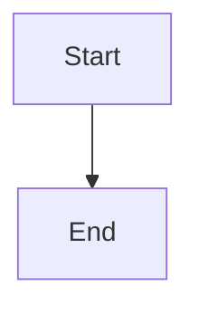

<div align="center">

# 🧜‍♀️ dsh-mermaid

**在 DeepSeek Harness 的 web client 里，把对话中的 ```mermaid 围栏代码渲染成 SVG 流程图。**

[](https://github.com/topics/dsh-plugin)
[](LICENSE)
[](https://github.com/Gurpartap/pi-mermaid)

[English](#english) · [中文](#中文)

</div>

## 中文

**这是一个移植（port）自 [pi-mermaid](https://github.com/Gurpartap/pi-mermaid)（MIT，[Gurpartap Singh](https://github.com/Gurpartap)）的 DeepSeek Harness 插件。** 上游在 Pi 的 TUI 里把 Mermaid 渲染成 ASCII 图；dsh 没有 TUI 渲染器，所以本移植把同一套解析与校验逻辑接到 dsh 的 web client，渲染成 SVG 图。上游文字是英文而受众是中文使用者——「100% 原样复制」规则禁止翻译，这里照实说明。

### 功能

- 🖼️ 对话中出现 ```mermaid 围栏（无论用户还是助手发送）时，自动渲染成 SVG 流程图
- ✅ 用 Mermaid 官方 parser 做语法校验，出错时在图下方显示 warning / error
- 📐 支持 `graph` / `flowchart`、`sequenceDiagram`、`classDiagram`、`erDiagram`、`stateDiagram(-v2)`
- 🗜️ 超大代码块（>400 行或 >20000 字符）自动跳过并提示
- 📚 每张图附带可折叠的源码块；`/mermaid` 命令手动重渲染最后一条助手消息
- 🧠 按 (session, turn) 缓存渲染结果，重复内容不重复计算

### 效果

对话里的

````

````

会变成一张真正的 SVG 流程图（而不是代码块）。sequenceDiagram、classDiagram 等类型同样支持。

### 安装

> ⚠️ 尚未发布到 npm。以下二选一：
>
> - 本地路径：先 `npm install` 再 `dsh plugin add ./dsh-mermaid`
> - GitHub 源码：`dsh plugin add github:GongYuanCaiJi/dsh-mermaid`（需要 allowBuilds 允许 `prepare` 构建）

```bash
# 本地路径安装
cd dsh-mermaid && npm install
dsh plugin --profile <你的profile> add ./dsh-mermaid
dsh --profile <你的profile> web

# 或 GitHub 源码安装
dsh plugin --profile <你的profile> add github:GongYuanCaiJi/dsh-mermaid
```

安装后在 web client 里发送一段包含 ```mermaid 围栏的消息，图就会出现在该轮对话的末尾。

### 使用

| 方式 | 说明 |
|---|---|
| 自动渲染 | 对话中出现 ```mermaid 围栏（用户或助手）即自动渲染 |
| `/mermaid` 命令 | 手动渲染最后一条助手消息里的 Mermaid 围栏 |

### 移植说明

- 核心逻辑（围栏提取、类型白名单、哈希缓存、parser 校验、issue 报告）逐行移植自 [pi-mermaid@0.3.0](https://github.com/Gurpartap/pi-mermaid)（MIT）
- 适配点：dsh 入口形状（`{ name, apply }`）；`ctx.on('session/event')` 取代 `pi.on('input'/'agent_end')`；`renderMermaidSVG` 取代 `renderMermaidAscii`（同一个 beautiful-mermaid 包）；TUI 渲染器改为 web client 槽（turnTail slot）
- 上游依赖 [beautiful-mermaid](https://github.com/lukilabs/beautiful-mermaid) 与 [Mermaid](https://github.com/mermaid-js/mermaid)，本移植保留
- 逐字保留与差异的完整清单见 [THIRD_PARTY_NOTICES.md](THIRD_PARTY_NOTICES.md)

**喜欢这个插件的话，也请给上游 [pi-mermaid](https://github.com/Gurpartap/pi-mermaid) 一个 star ⭐**

### 许可证

MIT © 2026 Gurpartap Singh (pi-mermaid) · © 2026 GongYuanCaiJi (dsh port)

---

## English

**A DeepSeek Harness plugin that renders ```mermaid fenced blocks in chat as SVG diagrams in the web client.**

This is a **port** of [pi-mermaid](https://github.com/Gurpartap/pi-mermaid) (MIT, by [Gurpartap Singh](https://github.com/Gurpartap)). Upstream renders Mermaid as ASCII art inside Pi's TUI; dsh has no TUI renderer, so this port keeps the same parsing/validation logic and renders SVG diagrams in the dsh web client instead. The README is bilingual because the upstream text is English while the audience is Chinese — the "copy 100% verbatim" rule forbids translation, so this note states it plainly.

### Features

- 🖼️ Auto-renders ```mermaid fences (from user or assistant messages) as SVG diagrams
- ✅ Syntax-validated by Mermaid's official parser; warnings/errors shown under the diagram
- 📐 Supports `graph` / `flowchart`, `sequenceDiagram`, `classDiagram`, `erDiagram`, `stateDiagram(-v2)`
- 🗜️ Oversized blocks (>400 lines or >20000 chars) are skipped with a notice
- 📚 Each diagram ships a collapsible source block; `/mermaid` command re-renders the last assistant message
- 🧠 Results are cached per (session, turn); repeats are not re-rendered

### Demo

A chat message containing

````

````

becomes a real SVG flowchart instead of a code block. `sequenceDiagram`, `classDiagram` and friends work the same way.

### Install

> ⚠️ Not published to npm yet. Pick one:
>
> - Local path: `npm install` first, then `dsh plugin add ./dsh-mermaid`
> - GitHub source: `dsh plugin add github:GongYuanCaiJi/dsh-mermaid` (needs allowBuilds so `prepare` can build)

```bash
# local path
cd dsh-mermaid && npm install
dsh plugin --profile <your-profile> add ./dsh-mermaid
dsh --profile <your-profile> web

# or GitHub source
dsh plugin --profile <your-profile> add github:GongYuanCaiJi/dsh-mermaid
```

After installing, send a message containing a ```mermaid fence in the web client — the diagram appears at the end of that turn.

### Usage

| Way | Description |
|---|---|
| Auto | Any ```mermaid fence in chat (user or assistant) renders automatically |
| `/mermaid` | Manually render Mermaid fences in the last assistant message |

### Port notes

- Core logic (fence extraction, type allowlist, hash cache, parser validation, issue reporting) is ported line-for-line from [pi-mermaid@0.3.0](https://github.com/Gurpartap/pi-mermaid) (MIT)
- Adaptations: dsh entry shape (`{ name, apply }`); `ctx.on('session/event')` instead of `pi.on('input'/'agent_end')`; `renderMermaidSVG` instead of `renderMermaidAscii` (same `beautiful-mermaid` package); the TUI renderer became a web client slot (turnTail)
- Upstream dependencies [beautiful-mermaid](https://github.com/lukilabs/beautiful-mermaid) and [Mermaid](https://github.com/mermaid-js/mermaid) are kept
- The full verbatim/diff inventory lives in [THIRD_PARTY_NOTICES.md](THIRD_PARTY_NOTICES.md)

**If you like this plugin, please also star the upstream [pi-mermaid](https://github.com/Gurpartap/pi-mermaid) ⭐**

### License

MIT © 2026 Gurpartap Singh (pi-mermaid) · © 2026 GongYuanCaiJi (dsh port)
